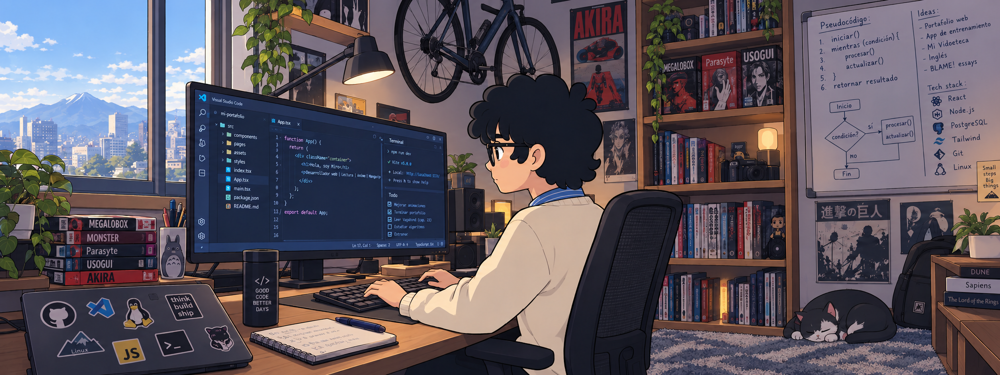

<h1 align="center"><b>😶‍🌫️ Miro — Estudiante de Ingeniería de Software y desarrollador web</b></h1>

> Estudiante de Ingeniería de Sistemas y apasionado por construir software entendiendo cómo funciona por dentro.

## 🚀 Sobre mí

- 🎓 Estudiante de Ingeniería de Software.
- 💻 Desarrollo aplicaciones web y exploro nuevas tecnologías.
- 🧠 Me gusta aprender desde los primeros principios.
- ⚙️ Interesado en el desarrollo frontend, backend, Linux e Inteligencia Artificial.
- 📚 Siempre construyendo proyectos para convertir teoría en práctica.

---

## 🛠️ Tecnologías que utilizo

     

---

## 🌱 Actualmente aprendiendo

- 🏗️ Arquitectura de Software
- ⚡ JavaScript moderno
- 🚀 Node.js y Express
- 🐧 Linux
- 🤖 Inteligencia Artificial
- ✅ Buenas prácticas de desarrollo

---

## 🌟 Proyecto destacado

### 🍕 Clau Food
Una aplicación web para un negocio de comidas rápidas, desarrollada como un proyecto real para mejorar la experiencia de pedidos.

- 🍔 Catálogo de productos organizado por categorías.
- 📱 Diseño totalmente responsive.
- ⚡ Interfaz rápida y ligera, sin dependencias pesadas.
- 💬 Realización de pedidos mediante WhatsApp.
- 🖼️ Imágenes optimizadas para una carga rápida.
- 🍟 Sección de combos y promociones.
- 🛠️ Desarrollado con HTML, CSS y JavaScript puro.
- 🚀 Desplegado gratuitamente con GitHub Pages.

📦 **Repositorio:** https://github.com/MiroDev20/clau-food-web

---

## 🔥 Racha de contribuciones

---

## 💡 Filosofía

> "No busco solo escribir código que funcione. Busco comprender por qué funciona."

---

## 📫 Contacto

- GitHub: https://github.com/mirodev20

---

⭐ Gracias por visitar mi perfil.
